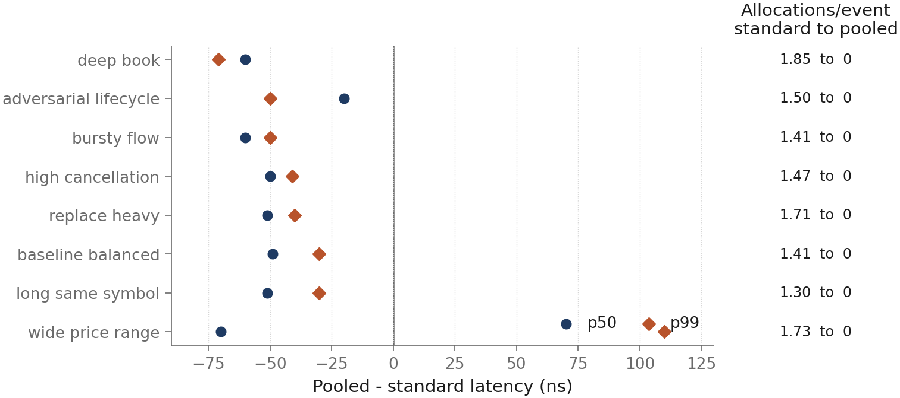
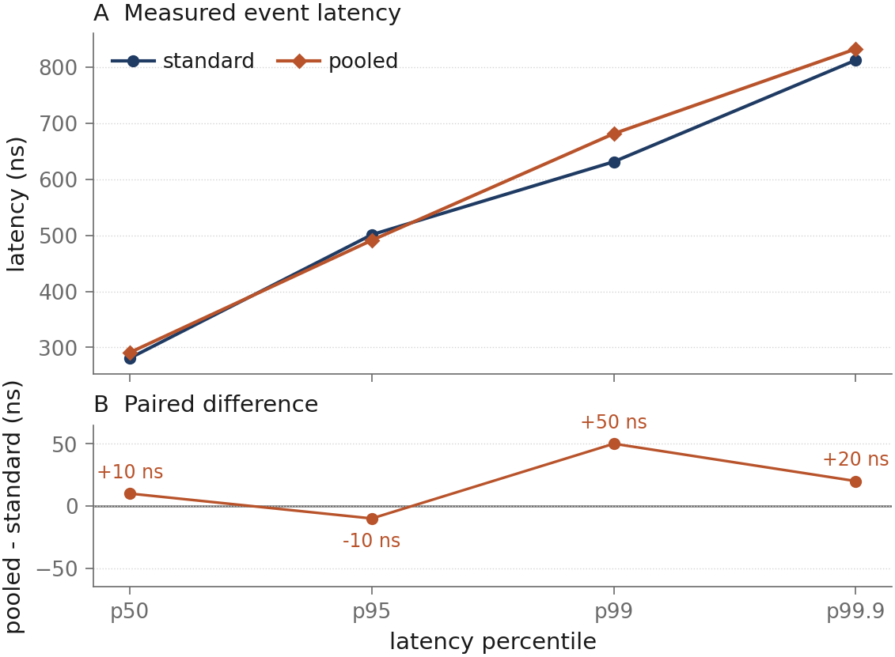
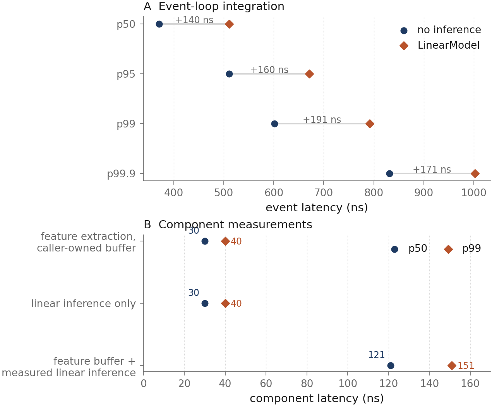
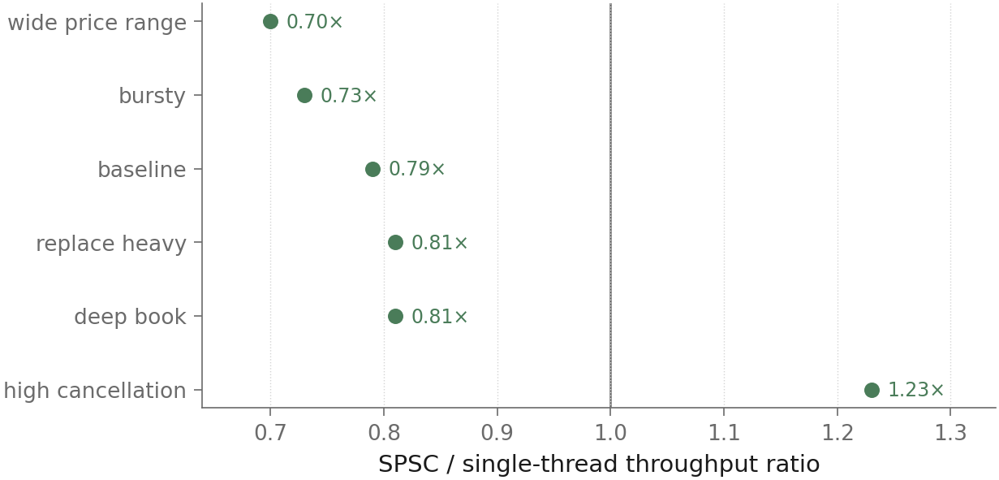

# Asterion: Determinism, Allocation and Latency in a C++20 Trading-System Path

Asterion is a C++20 research platform for deterministic market replay, L3 order-book state, price-time matching, pre-trade risk and measured inference integration. It measures how validation, memory management, concurrency and model execution affect the cost of an event-driven trading-system path.

### Research Paper

📄 **[Asterion: Deterministic Trading-System Infrastructure Under Latency and Allocation Constraints](paper/Asterion.pdf)**

## Main Finding

Memory allocation can be removed from the measured L3 hot path without changing the benchmark guard output, but the latency effect depends on workload and percentile. On Hamilton8, five iterations of the 1M-event high-cancellation corpus produced 5.0M measured events. The standard book recorded p50 281 ns, p99 631 ns and 7,340,580 allocations; the pooled book recorded zero allocations, the same guard checksum and p99 681 ns.

Across eight deterministic stress corpora, the pooled book records zero measured allocations throughout. It improves p50 on all eight and p99 on seven, while the wide-price-range corpus improves by 70 ns at p50 and regresses by 110 ns at p99.

<p align="center">
  
</p>

Paired p50 and p99 differences from one measured run per corpus. Negative values favour the pooled book; all eight pooled rows have zero measured allocations and matching guard checksums, and no confidence intervals are implied.

## Selected Results

| Evidence | Measurement | Interpretation |
| --- | --- | --- |
| L3 hot path | 5.0M high-cancellation events; standard p50 281 ns, p99 631 ns | Primary event-path baseline |
| Pooled book | 0 versus 7,340,580 allocations; pooled p99 681 ns; same guard checksum | Allocation removal does not uniformly reduce latency |
| LinearModel integration | p50 511 ns, p99 792 ns, 1.65M events/s | 140 ns median cost and no additional measured allocations |
| SPSC replay | Six 1M-event corpora; ratios 0.70x to 1.23x; zero drops | Throughput effect is workload-dependent |
| Public-L2 ONNX | 20,000 calls; p50 36.9 µs, p99 108.9 µs | Isolated runtime cost on a separate host |

## Tail Behaviour

For the 5.0M-event high-cancellation measurement, pooled storage changes p50 by +10 ns, p95 by -10 ns, p99 by +50 ns and p99.9 by +20 ns relative to the standard book.

<p align="center">
  
</p>

These are within-run percentiles from one Hamilton8 measurement, not confidence intervals. Absolute timing is host-dependent.

## Inference Cost

The LinearModel is measured inside the replay loop over 500,000 events. It records p50 511 ns, p99 792 ns and 1.65M events/s: a 140 ns median increase over the standard inference-free loop and no additional measured allocations over that node-book path.

<p align="center">
  
</p>

Panel A measures complete event-loop integration; panel B measures feature extraction, the model call and their wrapper separately. The plotted p50 and p99 values are within-run percentiles, while the ONNX result below uses a different runtime and host.

The public-L2 ONNX contract is measured separately over 20,000 calls with input `[1,16,40]` and output `[1,3]`. It records p50 36.9 µs, p99 108.9 µs and approximately 23.2k inferences/s; these isolated model-runtime timings are not directly comparable with the Hamilton8 event-loop measurements.

## Concurrency

The bounded SPSC path preserves checksum parity and drops zero events on all six 1M-event corpora. Throughput improves on the high-cancellation workload and falls on the other five, so the result is workload-dependent rather than a universal concurrency speed-up.

<p align="center">
  
</p>

Ratios come from one measured run per corpus on Hamilton8. Timing is host-dependent. The blocking policy guarantees zero drops; checksum parity held on all six corpora.

## System

```text
market events
    -> replay
    -> L3 book
    -> L2 / features
    -> strategy / inference
    -> pre-trade risk
    -> matching
    -> execution reports
```

Prices remain integer ticks through replay, risk and matching. Checksums, telemetry and audit records expose deterministic output surfaces without changing price-time matching semantics on the default path.

## Correctness

Correctness is exercised through Catch2 unit, golden and property tests; an independent Python reference matcher; grouped and shared replay parity; ASan and UBSan; and bounded libFuzzer targets for parsing, replay, matching and audit input.

## Hamilton8 Compute Provenance

The primary measurements were collected on Durham University Hamilton8 under Slurm.

| Item | Configuration |
| --- | --- |
| CPU | AMD EPYC 7702 |
| OS | Rocky Linux 8.10 |
| Compiler | GCC 13.2 |
| Build | Release `-O3 -DNDEBUG` |
| Allocation | One allocated CPU |
| Protocol | Warm-up before measurement; allocation counters reset before measured loops |
| Corpora | Deterministic seeds and SHA-256 provenance |

Deeper environment and measurement provenance is retained in [`results/manifest.json`](results/manifest.json).

## Reproduction

```bash
cmake -S . -B build -G Ninja \
  -DCMAKE_BUILD_TYPE=Release \
  -DASTERION_BUILD_PYTHON=ON

cmake --build build
ctest --test-dir build --output-on-failure

PYTHONPATH=build/python python -m pytest python/tests
./scripts/run_demo.sh --skip-build
```

Regenerate and verify the publication figures from the committed measurements:

```bash
pip install -e ".[figures]"
python figures/generate_figures.py
python figures/generate_figures.py --check
```

## Repository Structure

```text
cpp/         C++20 replay, book, matching, risk, inference and telemetry
python/      Python bindings and independent reference tooling
tests/       Unit, golden and property validation
benchmarks/  Measured hot-path and inference workloads
results/     Machine-readable benchmark measurements and provenance
figures/     Reproducible PNG and PDF research figures
data/        Schemas, fixtures and model contracts
scripts/     Reproduction and data-preparation entry points
```

## Citation

Citation metadata is in [`CITATION.cff`](CITATION.cff).

## Licence

Asterion is released under the [MIT Licence](LICENSE).
