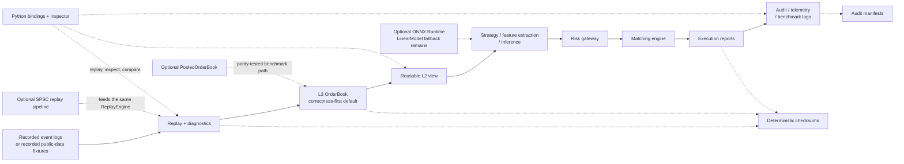

# Architecture Overview

Asterion is a deterministic C++20 trading systems lab. Its default path is
dependency-light and correctness-first: recorded or simulated events are replayed
into an auditable L3 order book, while order-entry workloads pass through risk
before local matching. Optional paths exist for systems experiments, but do not
replace the defaults.



Plain-text fallback:

```text
recorded event log / recorded public-data fixture
  -> replay + diagnostics
  -> L3 order book
  -> reusable L2 view
  -> strategy / feature extraction / inference
  -> risk gateway
  -> matching engine
  -> execution reports
  -> audit / telemetry / benchmark logs
```

## Main Path

- **Input and replay:** CSV, compact binary and recorded-public-data adapters feed
  deterministic replay. Public Binance depth fixtures are recorded L2 data adapted
  with documented synthetic order IDs; they are not a live feed.
- **Book and view:** `OrderBook` is the correctness-first L3 default. It exposes a
  reusable L2 projection for strategies, feature extraction and inspection.
- **Inference:** `LinearModel` is deterministic and always available. ONNX Runtime
  is optional; unavailable or incompatible ONNX requests fall back detectably.
- **Order-entry workload:** strategy-generated or simulated orders pass through the
  risk gateway before the local price-time-priority matching engine.
- **Evidence surfaces:** replay, matching and audit paths expose deterministic
  checksums. Telemetry and benchmark logs contain machine-dependent measurements
  and remain separate from correctness evidence.

## Optional Side Paths

| Side path | Purpose | Boundary |
| --- | --- | --- |
| SPSC replay pipeline | Bounded producer/consumer replay experiment | Opt-in; consumer reuses the single-thread `ReplayEngine`; not networking |
| `PooledOrderBook` | Allocation-reduction experiment with parity checks | Opt-in benchmark path; default `OrderBook` remains available |
| ONNX Runtime backend | Model-contract and systems-cost evaluation | Optional dependency; not installed by default; `LinearModel` fallback remains |
| Python bindings and inspector | Replay, diagnostics, checksums and offline JSON inspection | Thin tooling layer over deterministic C++ behavior |
| Audit manifests | Detect edits, truncation, missing/reordered files; optional local-key HMAC | Integrity tooling, not managed retention or custody |

Module-level details live in [DESIGN.md](../DESIGN.md), evidence mappings in
[evidence_index.md](evidence_index.md), and scope limits in
[LIMITATIONS.md](../LIMITATIONS.md).

## What This Diagram Does Not Imply

- No live trading, order placement, broker connectivity or authenticated exchange
  connectivity.
- No production-HFT or portable-latency claim.
- No alpha, profitability, signal-value or predictive-quality claim.
- No production model-serving claim.
